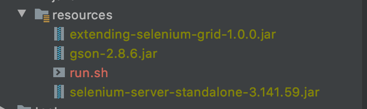

# Extending Selenium Grid
This is a project just to show you how to extend SeleniumGrid 
According to Customizing the Grid , if you want to access the inside of Hub, you should inherit RegistryBasedServlet, and if you don't, you should inherit HttpServlet.
This project's goal is to get all node to connect to  theselenium grid and status of them

##Sortware
Java JDK 1.8.0_191
selenium-server-standalone.jar version 3.14.0

##Run the Project  
Build project
```
cd extending-selenium-grid
mvn clean package
```
Copy jar file into resource


Start Hub by command

`java -cp selenium-grid-extend-1.0.0.jar:selenium-server-standalone-3.141.59.jar:gson-2.8.6.jar org.openqa.grid.selenium.GridLauncherV3 -role hub -servlets "selenium.extend.hub.servlet.NodeInfo,selenium.extend.hub.servlet.AllNodesState"`

Selenium Grid log

```
23:49:38.929 INFO [GridLauncherV3.lambda$buildLaunchers$5] - Launching Selenium Grid hub on port 4444
23:49:38.991 WARN [ExtraServletUtil.createServlet] - The specified class : selenium.extend.hub.servlet.NodeInfo cannot be instantiated selenium.extend.hub.servlet.NodeInfo
23:49:38.992 WARN [ExtraServletUtil.createServlet] - The specified class : selenium.extend.hub.servlet.AllNodesState cannot be instantiated selenium.extend.hub.servlet.AllNodesState
2020-11-01 23:49:39.378:INFO::main: Logging initialized @1362ms to org.seleniumhq.jetty9.util.log.StdErrLog
23:49:39.633 INFO [Hub.start] - Selenium Grid hub is up and running
23:49:39.638 INFO [Hub.start] - Nodes should register to http://192.168.1.52:4444/grid/register/
23:49:39.639 INFO [Hub.start] - Clients should connect to http://192.168.1.52:4444/wd/hub

```
Try to access

Open browser and enter with url http://localhost:4444/grid/admin/AllNodesState

 

